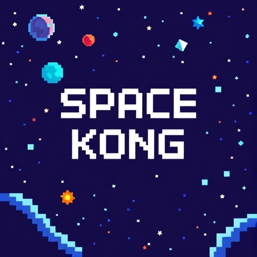

# Space Kong 🚀🦍

¡Bienvenido a **Space Kong**, una versión personalizada y temática del clásico juego Donkey Kong! Este proyecto ha sido diseñado en Unity, con personajes y elementos únicos que llevan la acción al espacio exterior. 🌌

<div align="center">
  
</div>

## Características del Juego
- **Gameplay clásico**: Escala niveles, esquiva meteoritos y rescata a la princesa.
- **Ambientación espacial**: Personajes y objetos rediseñados con una temática galáctica.
- **Meteoritos en lugar de barriles**: Los obstáculos principales han sido reemplazados por meteoritos ardientes.
- **Interfaz dinámica**: Muestra vidas y puntuación actualizada en tiempo real.

## Requisitos del Sistema
- Unity 2021.3 o superior.
- Sistema operativo: Windows, macOS o Linux.

## Cómo Jugar
1. Clona este repositorio en tu máquina local:
   ```bash
   gh repo clone EugenioRibon/Proyecto-Final-Paradigmas

2. Abre el proyecto en Unity
3. Asegúrate de que las escenas estén correctamente configuradas:
   - Preload Scene: Contiene el GameManager que controla la lógica del juego.
   - Level 1,2,3: Escenarios principales.
  
4. Presiona Play para comenzar.

## Controles
- Movimiento: Usa las teclas de dirección o WASD para mover al personaje.
- Acción: Usa la tecla Espacio para saltar.

## Créditos
- Desarrollo: Eugenio Ribón, Beltrán Sanchez
- Diseño de Personajes y Sprites: Creado con herramientas de pixel art y DALL·E.
- Motor: Unity.
